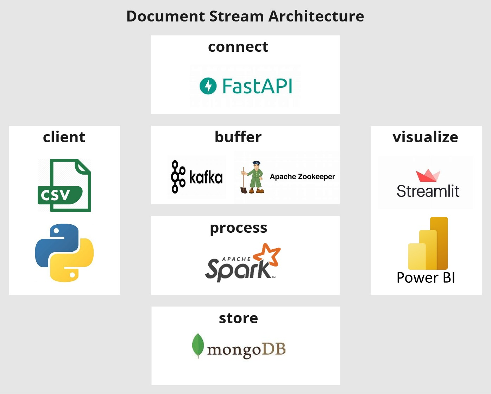
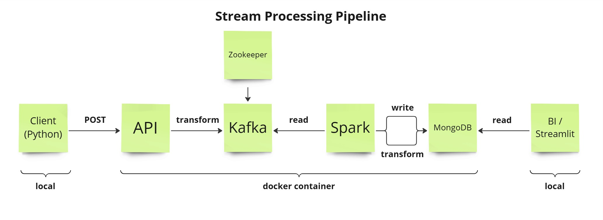
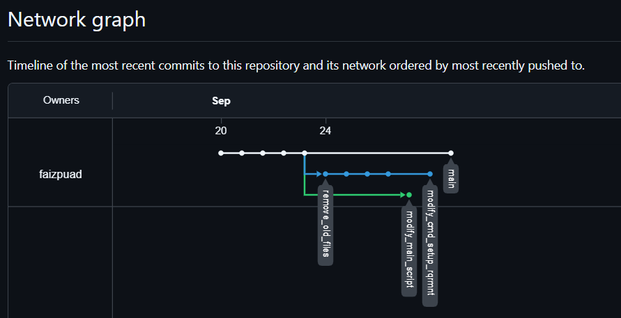
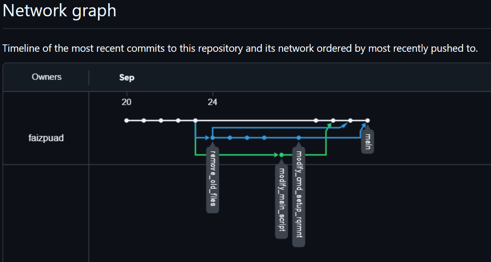
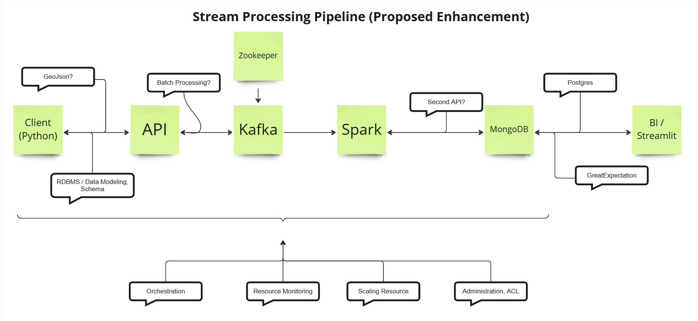

# Credit Card Fraud Transaction as Document Streaming Practice

## Introduction
This project focused on streaming process of data called `document streaming` using a simulated dataset of credit card transactions obtained from Kaggle. The dataset covers legitimate and fraudulent transactions from 1st January 2019 to 31st December 2020, including 1000 customers and transactions across 800 merchants. 

The main objectives of the project are:
- To simulate the data engineering pipeline, covering stages from data extraction to storage and visualization.
- To implement real-time data streaming and batch processing, using tools such as Kafka for message buffering and Spark for data processing.
- To discover possible drawback of this project's architecture that can be used as gap for my next data engineering project enhancement.

In real world scenario, this project pipeline is deployed, helps data analyst, data scientists and other downstream users to utilized the processed data for analytical purposes, such as identifying fraudulent transactions thru machine learning or even make custom dashboards and reports.

## Contents

- [The Data Set](#the-data-set)
- [Used Tools](#used-tools)
  - [Connect](#connect)
  - [Buffer](#buffer)
  - [Processing](#processing)
  - [Storage](#storage)
  - [Visualization](#visualization)
- [Pipelines](#pipelines)
  - [Stream Processing](#stream-processing)
    - [Storing Data Stream](#storing-data-stream)
    - [Processing Data Stream](#processing-data-stream)
- [Demo](#demo)
- [Conclusion](#conclusion)
- [Recommendation](#recommendation)
- [Follow Me On](#follow-me-on)
- [Appendix](#appendix)

## The Data Set
The dataset chosen is a simulated credit card fraud dataset from Kaggle. It contains both legitimate and fraudulent transactions, and includes a wide range of attributes such as transaction time, merchant details, customer information, and fraud flags. I selected this dataset because of my familiarity with bank data as a data analyst and thus such convenience should expedite my learning process for establishing this project.

The data dictionary is shown below:

| **Attribute**              | **Description**                        |
|----------------------------|----------------------------------------|
| `index`                    | Unique Identifier for each row         |
| `trans_date_trans_time`     | Transaction DateTime                   |
| `cc_num`                   | Credit Card Number of Customer         |
| `merchant`                 | Merchant Name                          |
| `category`                 | Merchant Category                      |
| `amt`                      | Transaction Amount                     |
| `first, last`              | Name of Credit Card Holder             |
| `is_fraud`                 | Fraud Flag (Target Variable)           |

## Used Tools
The project leverages several key technologies:

### Connect
Python scripts are used to extract data from CSV, convert each row into JSON format, and send it to an API endpoint for further processing. In here, data use from kaggle is the train data.

### Buffer
Kafka is used to handle real-time streaming. A Kafka topic is set up, where the API acts as the producer, and Spark consumes the data for further processing.

### Processing
Spark processes the raw data from Kafka, converting unstructured or single-line text into proper JSON objects. Data cleaning and transformations, such as standardizing date formats, are performed at this stage.

### Storage
MongoDB is the chosen NoSQL database due to its ability to efficiently store JSON documents. One collection is created 'transactions' with document `creditcard` to store the credit card transaction data.

### Visualization
A BI tool like Streamlit or PowerBI will be used for visualizing the stored data, with a focus on detecting fraud patterns and summarizing transaction insights.

## Pipelines
This project build a real-time stream processing pipeline.

### Stream Processing
- **Storing Data Stream**: Transaction data is streamed into Kafka topics, where each transaction is pushed in real-time.
- **Processing Data Stream**: Spark consumes the Kafka data stream, processes it, and sends the transformed data to MongoDB.

## Demo
A demo video or presentation link will be provided to showcase the project.

## Conclusion
This project demonstrates the end-to-end process of document streaming and real-time data processing, from data extraction to storage and visualization. Key learnings include the effective use of Kafka for streaming, Spark for processing, and MongoDB for storing JSON data. The biggest challenge was handling unstandardized datetime formats, creating cleaner json format in pandas and spark, and ensuring the correctness of real-time data flow.

I practiced version control using Git throughout this project. I created separate branches for different modifications to maintain version control and avoid directly editing the main branch. The branches are:

- main: 
  - The primary branch where all final editions are merged.
- remove_old_files: 
  - Used to remove unused or outdated files (e.g., preserving only transformer.py and removing transformer(backup).py).
- modify_and_setup_rqrmnt: 
  - Dedicated to editing markdown files, .yaml/.yml configurations, and image files.
- modify_main_script: 
  - A crucial branch for editing the main Python scripts and Dockerfile.

Finally, I merged all branch changes into the main branch as the final edition as shown below:

## Recommendation
During my journey of exploring the tools locally, I identified several areas for improvement that could have enhanced the project’s complexity, as well as improved data quality and governance overall. I’ve summarized my thoughts in the image below:

## Follow Me On
- [LinkedIn](https://www.linkedin.com/in/faizpuad/)

## Appendix
- [Kaggle Dataset](https://www.kaggle.com/datasets/kartik2112/fraud-detection?select=fraudTrain.csv)
- [Inspiration & Refrence from Coach Andreas Kretz Academy](https://learndataengineering.com/)
