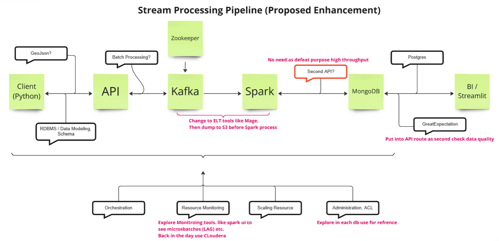

# 💳 Credit Card Fraud Transaction as Document Streaming Practice

## 🌟 Introduction
This project focuses on the streaming process of data called `document streaming` using a simulated dataset of credit card transactions obtained from Kaggle. The dataset covers legitimate and fraudulent transactions from 1st January 2019 to 31st December 2020, including 1000 customers and transactions across 800 merchants. 

The main objectives of the project are:
- 🔄 To simulate the data engineering pipeline, covering stages from data extraction to storage and visualization.
- ⚡ To implement real-time data streaming and batch processing, using tools such as Kafka for message buffering and Spark for data processing.
- 🔍 To discover possible drawbacks of this project's architecture that can be used as gaps for my next data engineering project enhancement.

In a real-world scenario, as this project pipeline is deployed, it helps data analysts, data scientists, and other downstream users to utilize the processed data for analytical purposes, such as identifying fraudulent transactions through machine learning or even making custom dashboards and reports.

## 📚 Contents

- [The Data Set](#-the-data-set)
- [Project Architecture](#-project-architecture)
- [Stream Processing Pipeline](#-stream-processing-pipeline)
- [Demo](#-demo)
- [Project Challenges](#-project-challenges)
- [Conclusion](#-conclusion)
- [Recommendation](#-recommendation)
- [Follow Me On](#-follow-me-on)
- [Appendix](#-appendix)

## 📊 The Data Set
The dataset chosen is a simulated credit card fraud dataset from Kaggle. It contains both legitimate and fraudulent transactions, and includes a wide range of attributes such as transaction time, merchant details, customer information, and fraud flags. I selected this dataset because of my familiarity with bank data as a data analyst and thus such convenience should expedite my learning process for establishing this project.

The data dictionary is shown below:

| **Attribute**              | **Description**                        |
|----------------------------|----------------------------------------|
| `trans_date_trans_time`   | Transaction date and time                     |
| `cc_num`                  | Credit card number                            |
| `merchant`                | Merchant name                                 |
| `category`                | Merchant category                             |
| `amt`                     | Transaction amount                            |
| `first`                   | First name of credit card holder              |
| `last`                    | Last name of credit card holder               |
| `gender`                  | Gender of credit card holder                  |
| `street`                  | Street address of credit card holder          |
| `city`                    | City of credit card holder                    |
| `state`                   | State of credit card holder                   |
| `zip`                     | ZIP code of credit card holder                |
| `lat`                     | Latitude of credit card holder's location     |
| `long`                    | Longitude of credit card holder's location    |
| `city_pop`                | Population of the cardholder's city           |
| `job`                     | Job of the credit card holder                 |
| `dob`                     | Date of birth of credit card holder           |
| `trans_num`               | Unique transaction identifier                 |
| `unix_time`               | Unix timestamp for the transaction            |
| `merch_lat`               | Latitude of the merchant's location           |
| `merch_long`              | Longitude of the merchant's location          |
| `is_fraud`                | Fraud flag (Target variable: 1 = Fraud, 0 = Not Fraud) |

## 🏗️ Project Architecture
The project leverages several key technologies:

There are 6 phases / processes involved in this document streaming project. Please find brief explanations on each process function:

1. **Client** 📁: The client refers to the origin point where raw data resides.
2. **Connect** 🔌: Scripts extract data from the source, transform it, and send it to an endpoint for further processing.
3. **Buffer** 🧱: A queuing system manages real-time data streams.
4. **Processing** ⚙️: Raw data is transformed and cleaned. 
5. **Storage** 💾: Processed data is stored in a database. 
6. **Visualization** 📈: A tool analyzes and displays the processed data.

## 🔄 Stream Processing Pipeline

Please find the process flow explanation for each process as below:

### Client
In the local machine, the raw data is in csv format. Python is used here to transport the data (POST method) into another service for data cleaning, transformation. This transform service is an API built using FASTAPI framework. Before transferring the data, I make sure to perform Exploratory Data Analysis [EDA.ipynb](./client/code/EDA.ipynb) (as per CRISP-DM framework) to ensure I have better understanding of the data (i.e., datatype, useful columns etc). I also play around with possible json schema that I want to enforce in this project [api_client.ipynb](./client/code/api_client.ipynb). The finalized data transformation into ideal json format is in script [transformer.py](./client/code/transformer.py) where the script will convert tabular data into desired data as output file path. Once data is transformed, the json data will be POSTed to API on specific route `/transaction` as in [api-client.py](./client/code/api-client.py).Below is the json schema implemented on this project:

> **Note**: Before continuing to scroll down this walkthrough, bear in mind that only the Client phase is done locally. The subsequent stages will be run in docker containers. To run multiple containers, docker-compose method is selected and network is set up to ensure each service/tool can communicate with each other in a dockerized environment. The composed file can be found here [docker-compose.yml](docker-compose.yml). It should be run first before implementing any of the tasks mentioned in this project.

### Connect
In this phase, API built through FASTAPI framework acts as intermediary between services. It benefits where any modification can be done inside the API instead of adjusting endpoint script (modular approach). I have created two routes `\transaction` and `\get_transactions`. Refer to the [main.py](./APIs/app/main.py) script.

- `\transaction`
  - After POST method sent to the API in previous stage, the API will perform data validation using pydantic BaseModel. The validation will check on whether incoming data is in desired format. Then, if it's a yes, second data transformation will perform in here where standardization of datetime is done (as to suit user requirement or certain database format). Kafka producer is initiated and Then json data will be sent to kafka topic through the producer.

- `\get_transactions`
  - This post method will be done by streamlit where it basically uses API to query data from mongodb using pymongo package and for sure data validation using pydantic BaseModel is also enforced here. 

### Buffer
Kafka is used to handle real-time streaming. The reason why there is a streaming process tool stage here is to avoid a situation where the incoming data is faster than what a database can process in a time by having a buffer. 

A Kafka topic is set up, where the json data from API will be sent through kafka producer, and later Spark consumes the data for further processing.

> **Note**: I have created the topic right after docker-compose is started

### Processing
Spark, being a consumer of the topic (following pub-sub model), processes the raw data from Kafka, converting unstructured or single-line text into proper JSON objects. Data cleaning and transformations, such as standardizing date formats, are performed at this stage. Then, processed data is sent to mongodb to be stored 

Refer [02-streaming-kafka-src-dst-mongodb.ipynb](./ApacheSpark/02-streaming-kafka-src-dst-mongodb.ipynb) for code implementation and for [01-streaming-kafka-src-dst.ipynb](./ApacheSpark/01-streaming-kafka-src-dst.ipynb) code playground.

### Storage
MongoDB is the chosen NoSQL database due to its ability to efficiently store JSON documents and also favor me to expand my skillset on NoSQL database query

> **Note**: I actually created a collection `transaction` and document `creditcard` beforehand to store the incoming json data  

### Visualization
Streamlit web app is used for visualizing the stored data. I have implemented a search filter for credit card number that will display transaction, customer and merchant information with map location of the merchant. It can actually expand for detecting fraud patterns and summarizing transaction insights. Refer [streamlitapp.py](./Streamlit/streamlitapp.py) for code implementation.

## 🎥 Demo
> **Video of project demo**:

> **Note 1**: I mistakenly said age restriction at 18 years old. It is actually 21 years old to able hold credit card.
> **Note 2**: Instead of showing yaml file in fastapi, I think better to refer here [README.md](./APIs/README.md)

### Screenshot / Excerpt of Project

- Sample transformed CLient in Output file formatted

- Transformed data in Client send to API

- Sample API Test in Postman. Using collections [doc_stream_postman.json](./APIs-POSTMAN/doc_stream_postman.json)

 

- Sample API Test in Postman with invalid datetime. Status 500

- Sample API Test in Postman with correct input. Status 201

- MongoDB Collection `transaction` and Document `creditcard` creation

- Successful Data Store in MongoDB 

- Streamlit web app initial state

- Streamlit web app with input data

## 🚧 Project Challenges
The biggest challenge was handling and transforming nested json schema. I also had trouble communicating with other services like changing localhost to service name. I encountered errors several times when trying to post data and had headaches understanding the HTTP 500 error codes. I realized detaching docker-composed run up is bad for troubleshooting. 

## 🎓 Conclusion
This project demonstrates the end-to-end process of document streaming and real-time data processing, from data extraction to storage and visualization. Key learnings include the effective use of Kafka for streaming, Spark for processing, and MongoDB for storing JSON data. The biggest challenge was handling unstandardized datetime formats, creating cleaner json format in pandas and spark, and ensuring the correctness of real-time data flow.

I practiced version control using Git throughout this project. I created separate branches for different modifications to maintain version control and avoid directly editing the main branch. The branches are:

- main: 
  - The primary branch where all final editions are merged.
- remove_old_files: 
  - Used to remove unused or outdated files (e.g., preserving only transformer.py and removing transformer(backup).py).
- modify_and_setup_rqrmnt: 
  - Dedicated to editing markdown files, .yaml/.yml configurations, and image files.
- modify_main_script: 
  - A crucial branch for editing the main Python scripts and Dockerfile.

Finally, I merged all branch changes into the main branch as the final edition as shown below:

## 🚀 Recommendation
During my journey of exploring the tools locally, I identified several areas for improvement that could have enhanced the project's complexity, as well as improved data quality and governance overall. I've summarized my thoughts in the image below:

## 🤝 Follow Me On
- [LinkedIn](https://www.linkedin.com/in/faizpuad/)

## 📚 Appendix
- [Kaggle Dataset](https://www.kaggle.com/datasets/kartik2112/fraud-detection?select=fraudTrain.csv)
- [Inspiration & Reference from Coach Andreas Kretz Academy](https://learndataengineering.com/)